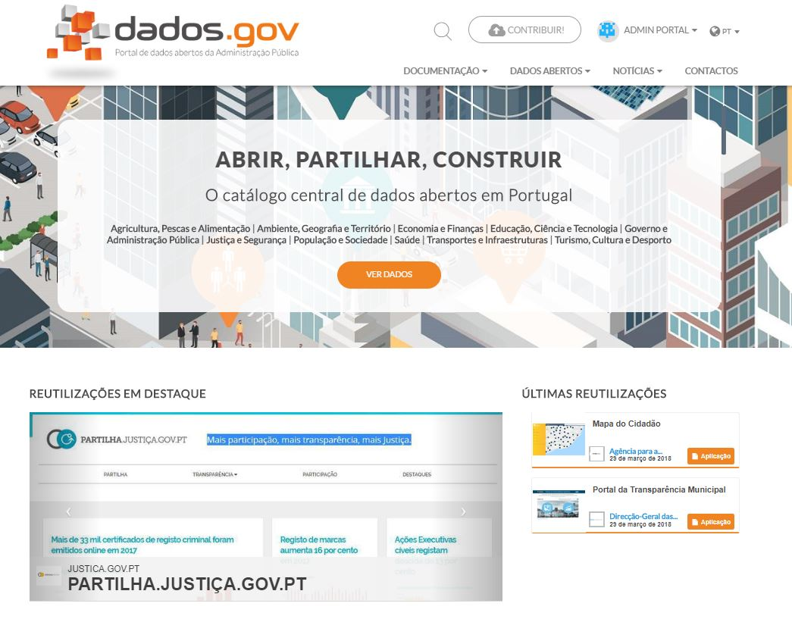

# Administração da plataforma:

- [Homepage](#homepage)
- [Notícias](#notícias)
- [Eventos](#eventos)
- [Destaques](#destaques)
- [Banners](#banners)
- [Temas](#temas)
- [Utilizadores](#utilizadores)

## Homepage

Para controlar dinamicamente os conteúdos presentes no dados.gov foram criados vários tipos de exposição dos mesmos em que o seu controlo é baseado em etiquetas. Todos os conteúdos têm por base artigos na perspectiva do uData.

### Notícias
Uma notícia é o formato mais simples de um artigo, qualquer artigo criado no uData é considerado uma notícia, sem necessidade de atribuir qualquer etiqueta.

### Eventos
Um evento é um artigo no qual a etiqueta “evento” foi adicionada, o dados.gov vai detectar essa etiqueta para realçar e possibilitar o filtrar de eventos.

### Destaques
A etiqueta “destaque” é utilizada para colocar em pré-visualização um artigo na parte central da home-page (entre as reutilizações e os conjuntos de dados em destaque), apenas um artigo será apresentado, no caso de vários artigos com esta tag apenas o mais recente será selecionado. 

### Banners
A etiqueta “banner” é utilizada para colocar em destaque na parte principal da home-page um ou mais artigos. Serão apresentados todos os artigos com esta etiqueta por ordem cronológica. É ainda possivel controlar o endereço do botão ao utilizar a tag “vernoticia” que passa a endereçar para o corpo da notícia (“Ver Mais”), caso contrário será endereçado para a listagem dos conjuntos de dados por defeito (“Ver Dados”).

Resolução recomendada para a imagem a utilizar como banner: 2100x1050 pixéis.

## Temas

Estas funcionalidades só são válidas para utilizadores que sejam administradores do portal.

Publicar um tema:

1.	Clicar em ‘+’ na administração;

2.	Selecionar ‘Adicionar um tema’;

 
3.	Preencher os campos do formulário:

    a.	Etiquetas: O dados.gov seleciona os conjuntos de dados que melhor se adequam ao tema, para tal deve apenas selecionar etiquetas relacionadas com o mesmo.

    b.	Em Destaque: Este campo deverá ser selecionado para que o tema fique público no portal.

4.	Adicionar os conjuntos de dados (se existirem) relacionados ao tema;

5.	Adicionar as reutilizações (se existirem) relacionadas ao tema.

Existem também outras funcionalidades para ajudar na gestão dos conteúdos do portal, nomeadamente, editar, transferir ou eliminar.

A edição serve para editar o conteúdo de conjuntos de dados, reutilizações, organizações, temas ou utilizadores.

   
A transferência permite que um conjunto de dados ou uma reutilização seja transferida para outro utilizador ou outra organização. Para concluir a transferência será sempre necessário que esta seja aceite pelas entidades de destino e, no caso de o destino ser uma organização, o utilizador tem de ser administrador da mesma.

 
Por fim, quando um conteúdo é eliminado do portal o mesmo deixa de estar visível para os outros utilizadores e é associada automaticamente uma etiqueta ‘Eliminado’. O conteúdo continuará a ser visível para o administrador do conteúdo durante 24 horas. Depois disso, o conteúdo será eliminado definitivamente do portal.
 

## Utilizadores

Um ponto importante relativamente à gestão de utilizadores é que existe a possibilidade de adicionar outros utilizadores como administradores. Para isso, basta ir para a edição do utilizador e selecionar a opção ‘admin’ no campo ‘Perfis’. Esta funcionalidade só está disponível para utilizadores que sejam administradores do portal.

Para remover o perfil administrador de um utilizador basta realizar o mesmo processo e selecionar a opção ‘admin’ juntamente com a tecla CTRL.
