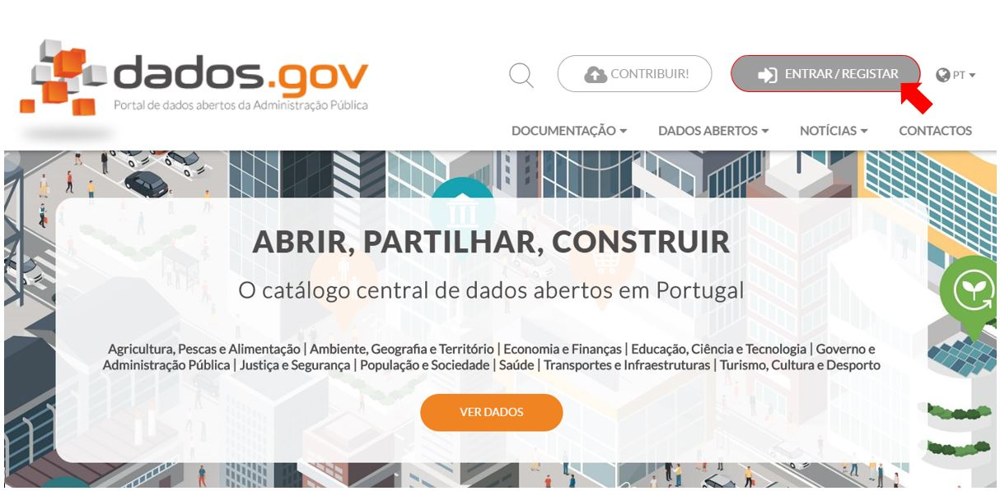
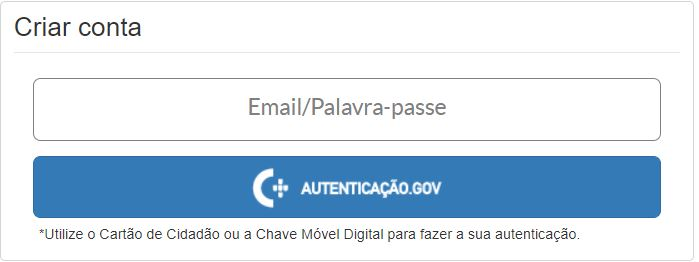
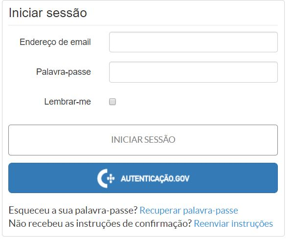
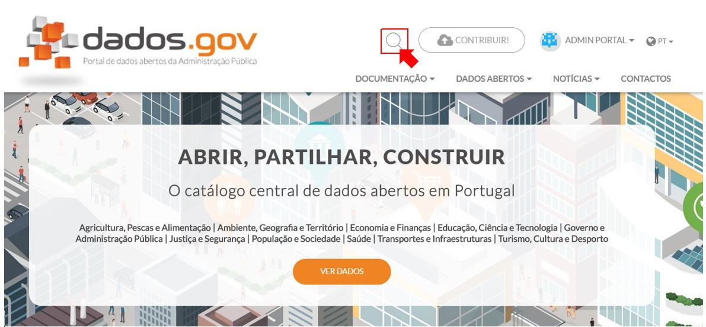
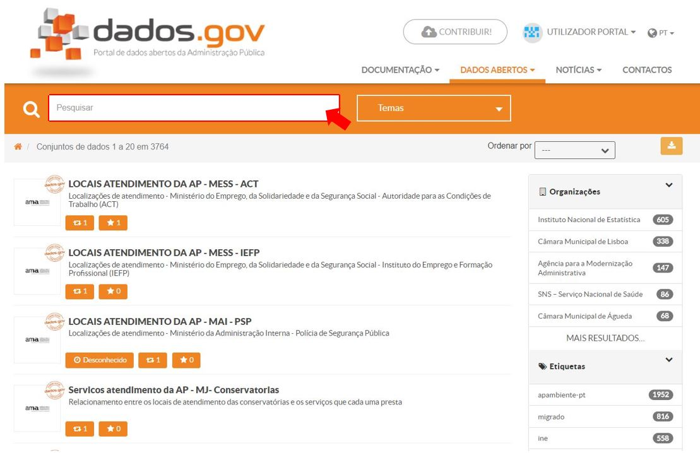
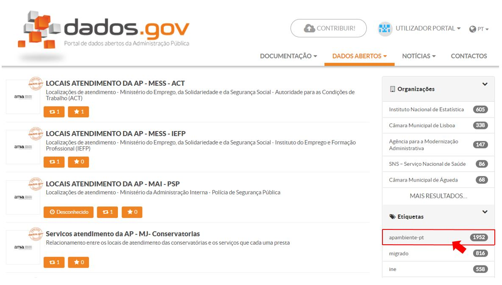
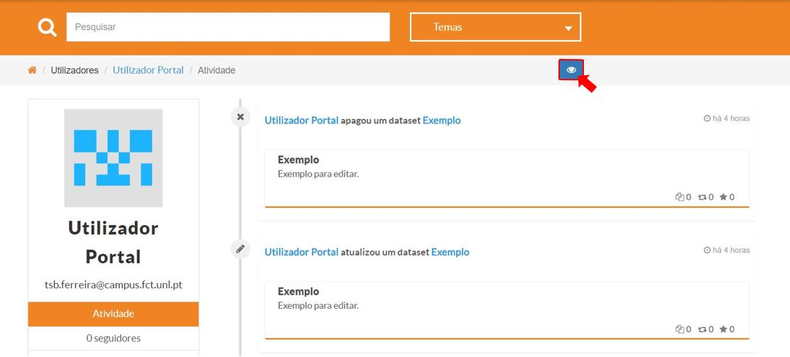
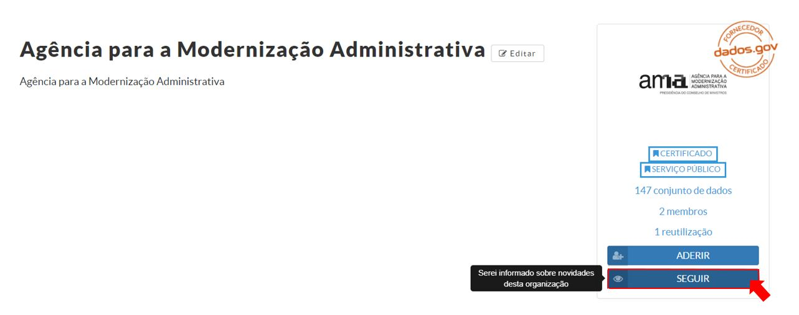
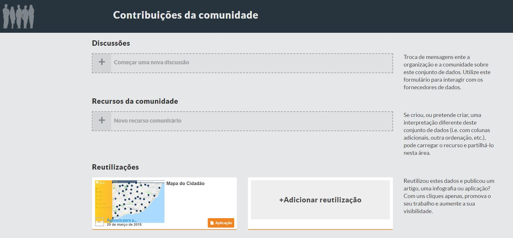

# Funcionalidades

## Registo de Utilizador

Para se autenticar no portal dados.gov basta clicar em ‘Entrar/Registar’ e escolher o caso que mais se adequa a si. 

Se ainda não fez o seu registo escolha ‘Criar conta’ e selecione ‘Email/Palavra-passe’ ou ‘Autenticação.Gov’ se pretender utilizar o cartão de cidadão ou a chave móvel digital para fazer a sua autenticação. Uma vez que efectuou o registo receberá no e-mail que inseriu, um link para ativar a sua conta.

Caso contrário, precisa apenas de iniciar sessão com as credênciais respetivas ou via Autenticação.Gov.

 
## Pesquisas

Existem dois campos de pesquisa no portal dados.gov. Um deles é vísivel quando  clica no icon ‘lupa’ quando se encontra na página inicial. Uma vez que sai desta página passará a ter o mesmo campo ‘Pesquisar’ na parte superior de cada página do portal.

Nestes campos pode pesquisar nomes de conjuntos de dados, organizações, reutilizações, distritos, concelhos e freguesias.Tem ainda possibilidade de personalizar ainda mais a sua pesquisa selecionando mais opções que se encontram na barra lateral direita da página, como por exemplo, etiquetas, licenças, cobertura temporal, formatos, etc. 

## Interações Sociais 

O portal dados.gov também tem uma vertente social, isto é, é possível seguir utilizadores e organizações. Ao optar por esta opção passará a acompanhar a atividade dos mesmos. 

Pode também trocar mensagens entre a organização e a comunidade sobre um dado conjunto de dados. Para isso basta utilizar o formulário ‘Discussões’ em ‘Contribuições da comunidade’ para interagir com os fornecedores de dados. Nesta mesma área também pode carregar e partilhar um recurso que ache que tenha um interpretação diferente do conjuntos de dados (i.e. com colunas adicionais, outra ordenação, etc). 

