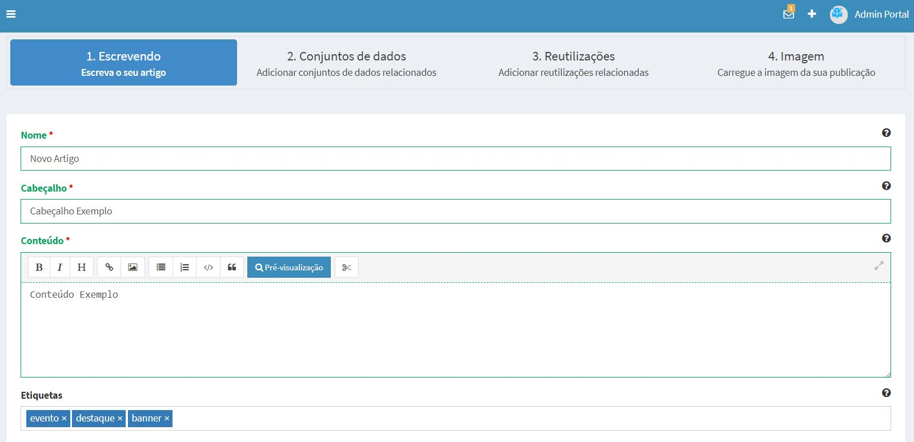
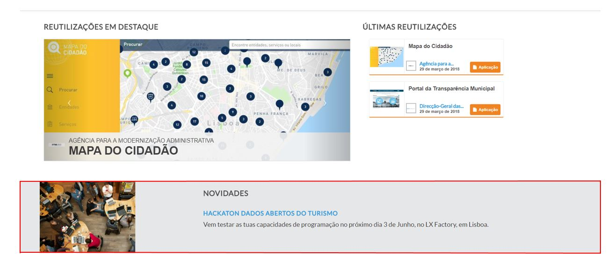
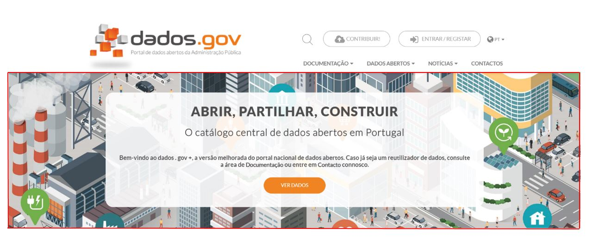

# Gestão da Homepage (Admin):

Em virtude da necessidade de controlar dinamicamente os conteúdos presentes no dados.gov foram criados vários tipos de exposição dos mesmos em que o seu controlo é baseado em etiquetas. Todos os conteúdos têm por base artigos na perspectiva do uData.

## Notícias
Uma notícia é o formato mais simples de um artigo, qualquer artigo criado no uData é considerado uma notícia, sem necessidade de atribuir qualquer etiqueta.

## Eventos:
Um evento é um artigo no qual a etiqueta “evento” foi adicionada, o dados.gov vai detectar essa etiqueta para realçar e possibilitar o filtrar de eventos.

## Destaques:
A etiqueta “destaque” é utilizada para colocar em pré-visualização um artigo na parte central da home-page (entre as reutilizações e os conjuntos de dados em destaque), apenas um artigo será apresentado, no caso de vários artigos com esta tag apenas o mais recente será selecionado. 

## Banners:
A etiqueta “banner” é utilizada para colocar em destaque na parte principal da home-page um ou mais artigos. Serão apresentados todos os artigos com esta etiqueta por ordem cronológica. É ainda possivel controlar o endereço do botão ao utilizar a tag “vernoticia” que passa a endereçar para o corpo da notícia (“Ver Mais”), caso contrário será endereçado para a listagem dos conjuntos de dados por defeito (“Ver Dados”).

