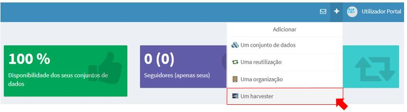
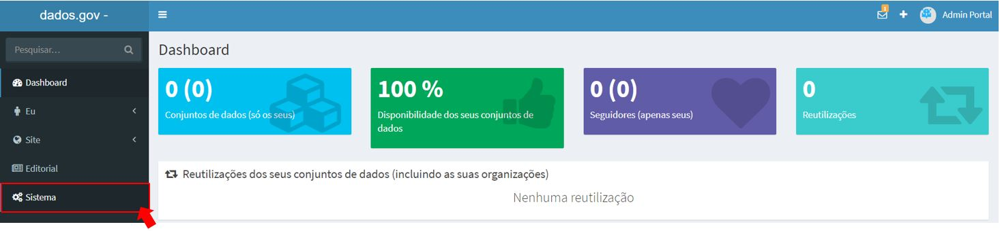
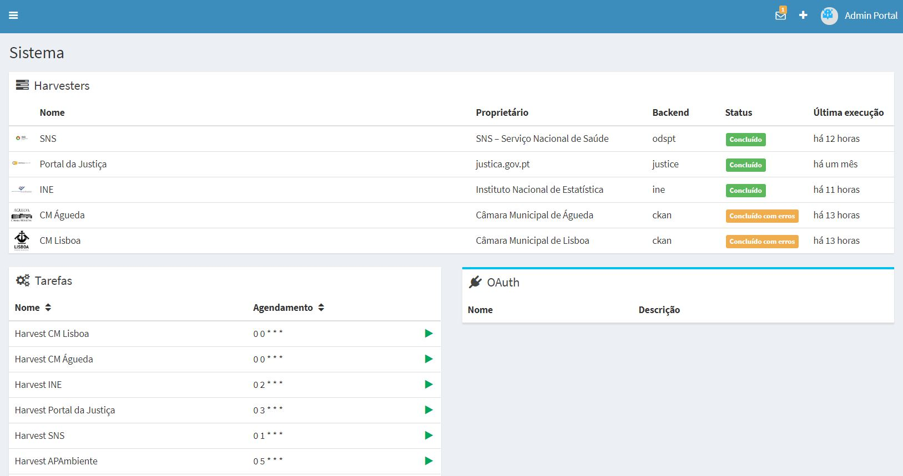
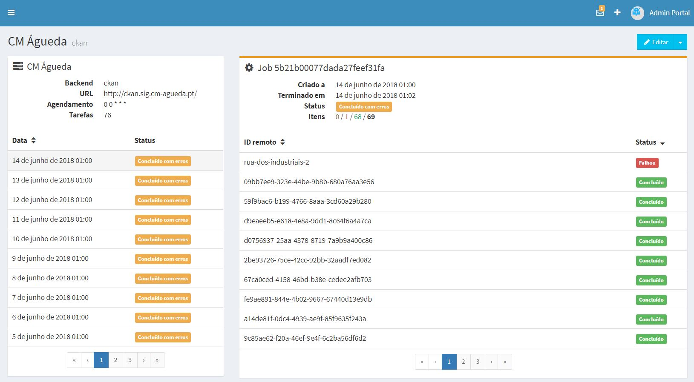

# Módulo Sistema (ADMIN)

## Criar um Harvester para recolha de dados

A acção de fazer “harvesting” é uma das funcionalidades mais importantes do dados.gov, esta permite indexar e catalogar outros portais de dados abertos.

Para criar/agendar uma tarefa de harvesting é necessário no backend selecionar a opção ‘Adicionar um harvester’, escolher a entidade sob a qual os conjuntos de dados serão publicados, preencher os campos do formulário com especial atenção para o URL que deve ser o endpoint do serviço a indexar e o Backend que estabelece o protocolo a utilizar para a indexação ( DCAT, CKAN, ODS, etc... ). 
No caso dos backends com extensão PT ( CKAN PT, OpenDataSoftPT ), o acto de harvesting vair indexar/criar organizações no dados.gov, nesse caso e para evitar duplicados é necessário garantir que o “slug” da organização coincida com o da origem.

 

 

## Gestão de harvesters

O gerenciamento de harvesters é feito no backend na secção “Sistema” na qual é possivel visualizar o estado, historico de execução e agendamento, ao selecionar um harvester é possivel obter um histórico completo de todas as operações efectuadas bem como perceber se há problemas com a indexação de algum dataset.

 

 

 
